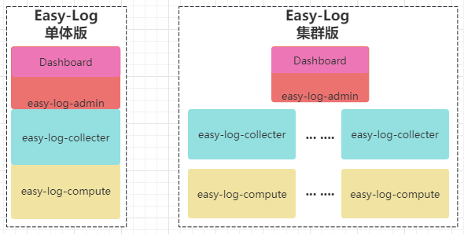

<p align="center">
	
</p>
<h1 align="center">Easy-Log</h1>
<h4 align="center">易用的日志收集、分析和检索工具</h4>
<p align="center">
	<a href="https://gitee.com/fun-tan90/easy-log/stargazers"></a>
	<a href="https://gitee.com/fun-tan90/easy-log/members"></a>
    <a href="./LICENSE">
        
    </a>
    <a>
        
    </a>
    <a>
        
    </a>
    <a>
        
    </a>
</p>

---

## 项目特性

- 无代码入侵的分布式日志系统，基于log4j、log4j2、logback搜集日志，基于[TLog](https://tlog.yomahub.com)实现链路追踪，方便查询关联日志
- elasticsearch作为日志存储、查询分析引擎，利用Data Streams + ILM机制自动管理日志索引的生命周期
- 基于MQTT协议实现日志收集、在线调整应用日志级别、日志告警及日志实时过滤等功能

## 核心架构


---

## 核心模块说明

- mqtt broker负责日志消息发布与订阅，基于[EMQX](https://www.emqx.io/zh)中间件实现,**_不熟悉mqtt协议的同学，可以简单理解成消息中间件_**
- easy-log-admin负责用户认证、日志告警规则、日志实时过滤等基础信息管理
- easy-log-compute主要实现日志告警、日志实时过滤和日志收集速率计算等功能
- easy-log-collector主要负责订阅日志数据，批量插入ES集群

## Easy-Log部署

1. [ES集群部署](doc/quick-start/es/es.md)
2. [Redis部署](doc/quick-start/redis/redis.md)
3. [EMQX集群部署](doc/quick-start/emqx/emqx.md)
4. [Easy-Log部署](doc/quick-start/easy-log/el.md)

**Easy-Log支持两种部署方式**



---

## 应用端接入说明

### 创建配置文件

```properties
# 创建src/main/resources/easy-log.properties，文件名固定为easy-log.properties
appName=demo                            #应用名称
namespace=test                          #命名空间
mqttAddress=tcp://ip:1883               #emqx地址
queueSize=10240                         #队列大小
maxPushSize=500                         #日志批推送大小
```

---

### maven依赖引入

```xml
<dependencies>
    <!--结合项目中使用的日志框架-->
    <dependency>
        <groupId>fun.tan90</groupId>
        <artifactId>easy-log-[log4j2|log4j|logback]-appender</artifactId>
        <version>1.1.17</version>
    </dependency>
    <!--tlog 
        一个轻量级的分布式日志标记追踪神器，10分钟即可接入，自动对日志打标签完成微服务的链路追踪
        基于tlog实现日志链路追踪，强烈建议引入该依赖
    -->
    <dependency>
        <groupId>com.yomahub</groupId>
        <artifactId>tlog-all-spring-boot-starter</artifactId>
        <version>1.5.1</version>
    </dependency>
</dependencies>
```

## 修改日志配置文件

### logback 配置

```xml
<configuration scan="false" debug="false">
    <!--其他Appender-->
    <appender name="EASY_LOG" class="fun.tan90.easy.log.logback.appender.EasyLogAppender"/>
    <root level="INFO">
        <!--其他appender-ref-->
        <appender-ref ref="EASY_LOG"/>
    </root>
</configuration>
```

### log4j2 配置

```xml
<Configuration>
    <Appenders>
        <!--其他Appender-->
        <EasyLog name="EASY_LOG"/>
    </Appenders>

    <Loggers>
        <root level="info">
            <!--其他appender-ref-->
            <appender-ref ref="EASY_LOG"/>
        </root>
    </Loggers>
</Configuration>
```

### log4j 配置

```properties
log4j.appender.EASY_LOG=fun.tan90.easy.log.log4j.appender.EasyLogAppender
```