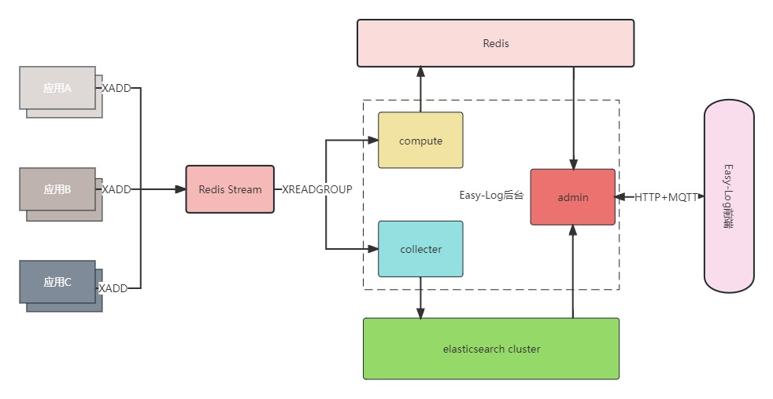

## 项目特性

- 无代码入侵的分布式日志系统，基于log4j2、logback搜集日志，基于TLog实现链路追踪，方便查询关联日志
- elasticsearch作为日志存储、查询、分析聚合引擎，使用ES的Data Streams + ILM机制自动完成日志索引全生命周期管理

## 系统架构


---

>核心模块说明
- easy-log-mqtt服务端，负责消息推送
- easy-log-admin负责后台管理，认证、告警、实时过滤等基础信息管理
- easy-log-collector负责从Redis Stream中订阅数据，批量插入ES集群中
- easy-log-compute主要实现日志告警、实时日志过滤和日志收集速率计算等功能

## 使用说明

- 应用端集成
```xml
<dependencies>
    <!--{xxxx} 目前支持log4j2和logback-->
    <dependency>
        <groupId>com.chj</groupId>
        <artifactId>easy-log-{xxxx}-appender</artifactId>
        <version>${latest}</version>
    </dependency>
    <!--tlog 
        一个轻量级的分布式日志标记追踪神器，10分钟即可接入
        自动对日志打标签完成微服务的链路追踪
        基于tlog实现日志链路追踪，强烈建议引入该依赖，教程详见官网 https://tlog.yomahub.com/
    -->
    <dependency>
        <groupId>com.yomahub</groupId>
        <artifactId>tlog-all-spring-boot-starter</artifactId>
        <version>${latest}</version>
    </dependency>
</dependencies>
```
- 修改日志配置文件

```xml
<!--logback 配置-->
<configuration scan="false" debug="false">
    <!--其他Appender-->
    <appender name="REDIS_STREAM" class="com.chj.easy.log.logback.appender.redis.EasyLogRedisAppender">
        <!--应用名称，默认unknown-->
        <appName>easy-log-example-boot2-logback</appName>
        <!--命名空间，默认default-->
        <namespace>default</namespace>
        <!--批量推送数量，默认500-->
        <maxPushSize>500</maxPushSize>
        <!--jvm缓存队列大小，默认10240-->
        <queueSize>10240</queueSize>
        <!--redis模式，单机single、哨兵Sentinel、集群cluster，默认single-->
        <redisMode>single</redisMode>
        <!--redis服务端地址，默认127.0.0.1:6379-->
        <redisAddress>114.217.55.239:6379</redisAddress>
        <!--redis库号，默认0-->
        <redisDb>3</redisDb>
        <!--redis密码,默认为null-->
        <redisPass>ICONMAN20220106R</redisPass>
        <!--redis连接超时时间,默认1000-->
        <redisConnectionTimeout>1000</redisConnectionTimeout>
        <!--redis Stream最多存储消息数,默认1000000-->
        <redisStreamMaxLen>1000000</redisStreamMaxLen>
        <!--redis连接池最大空闲数，默认30-->
        <redisPoolMaxIdle>30</redisPoolMaxIdle>
        <!--redis连接池最大连接数，默认200-->
        <redisPoolMaxTotal>200</redisPoolMaxTotal>
        <!--mqttAddress服务端地址,默认127.0.0.1:1883-->
        <mqttAddress>127.0.0.1:1883</mqttAddress>
    </appender>

    <root level="INFO">
        <!--其他appender-ref-->
        <appender-ref ref="REDIS_STREAM"/>
    </root>
</configuration>
```

```xml
<!--log4j2 配置-->
<Configuration>
    <Appenders>
        <!--其他Appender-->
        <EasyLogRedis name="REDIS_STREAM_TEST"
                      appName="easy-log-example-boot2-log4j2"
                      namespace="prod"
                      maxPushSize="100"
                      queueSize="10240"
                      redisMode="single"
                      redisAddress="114.217.55.239:6379"
                      redisDb="3"
                      redisPass="ICONMAN20220106R"
                      redisConnectionTimeout="1000"
                      redisStreamMaxLen="1000000"
                      redisPoolMaxTotal="200"
                      redisPoolMaxIdle="30"
                      mqttAddress="127.0.0.1:1883"
        />
    </Appenders>

    <Loggers>
        <root level="info">
            <!--其他appender-ref-->
            <appender-ref ref="REDIS_STREAM_TEST"/>
        </root>
    </Loggers>
</Configuration>

```
**代码提交规范**
- feat: 新功能
- fix: 修复 Bug
- docs: 文档修改
- perf: 性能优化
- revert: 版本回退
- ci: CICD集成相关
- test: 添加测试代码
- refactor: 代码重构
- build: 影响项目构建或依赖修改
- style: 不影响程序逻辑的代码修改
- chore: 不属于以上类型的其他类型(日常事务)
