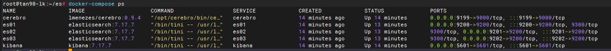
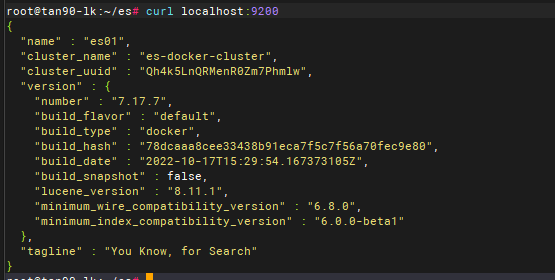
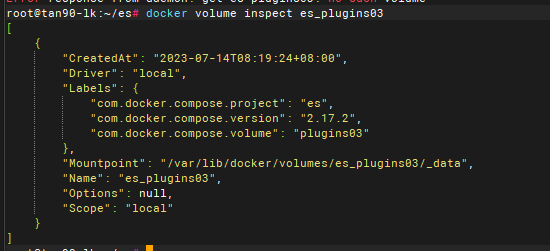
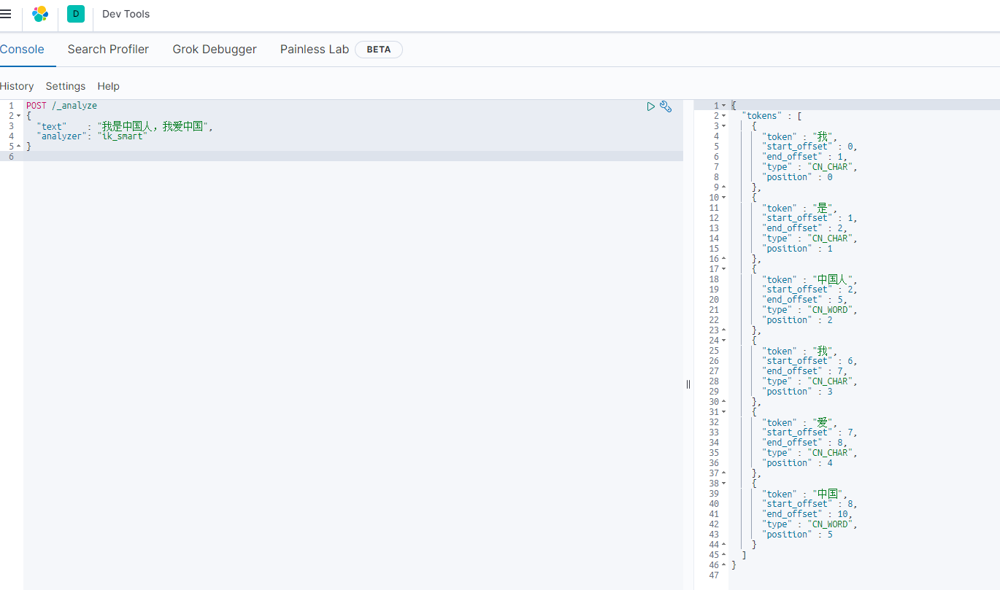

# docker版es集群安装教程
## 前置条件
- 对elasticsearch有基础了解
- 宿主机上安装docker，安装教程找官网或百度
- 宿主机上安装docker-compose，安装教程找官网或百度
- 宿主机建议4G以上内存

#### 1、创建网络!
```shell
# --driver：驱动程序类型
# --gateway：主子网的IPV4和IPV6的网关  可修改
# --subnet：代表网段的CIDR格式的子网   可修改
# mynet：自定义网络名称                 
docker network create --driver=bridge --gateway=172.18.0.1 --subnet=172.18.0.0/16 net_dev
```
#### 2、启动es集群

- 将es文件夹复制到宿主机上
- 在es目录下，执行docker-compose up -d 命令
- 验证集群是否启动成功

```shell
docker-compose ps
```

```shell
curl localhost:9200
```

#### 3、安装ik分词器
```
# github地址
https://github.com/medcl/elasticsearch-analysis-ik
支持分词器的拓展和停用词典
```

- 1、将elasticsearch-analysis-ik-7.9.3.zip解压，文件夹名称为ik
```shell
unzip elasticsearch-analysis-ik-7.9.3.zip -d ik
```
- 2、将ik文件夹复制到三个es节点的plugins数据卷中,查询宿主机数据卷路径命令如下：
```shell
docker volume inspect es_pluginsXX
```

```shell
cp -r ik /var/lib/docker/volumes/es_plugins03/_data
```
- 3、重启三个es节点
```
docker-compose restart
```
- 4、使用kibana的Dev Tools工具验证ik分词器是否安装成功

#### 4、恭喜安装成功