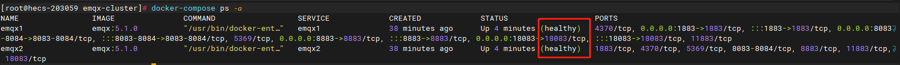

# docker版emqx集群安装教程

#### 1、创建网络!
**_如果在安装ES集群时，已创建网络忽略该步骤_**
```shell
# --driver：驱动程序类型
# --gateway：主子网的IPV4和IPV6的网关  可修改
# --subnet：代表网段的CIDR格式的子网   可修改
# el_net：自定义网络名称                 
docker network create --driver=bridge --gateway=172.18.0.1 --subnet=172.18.0.0/16 el_net
```

#### 2、创挂载数据卷文件夹并授权
```shell
mkdir -p emqx_data_01 emqx_data_02
chmod 777 emqx_data_*
```

#### 3、启动EMQX集群
- 将emqx文件夹复制到宿主机上
- 在emqx目录下，执行docker-compose up -d 命令
```shell
# 启动EMQX集群
docker-compose up -d
# 查看集群状态
docker-compose ps -a
```


#### 4、打开EMQX Dashboard页面
[EMQX官方文档](https://www.emqx.io/docs/zh/v5.1)
```shell
# 浏览器打开如下地址
# 默认账号/密码为：admin/public
http://ip:18083
```
